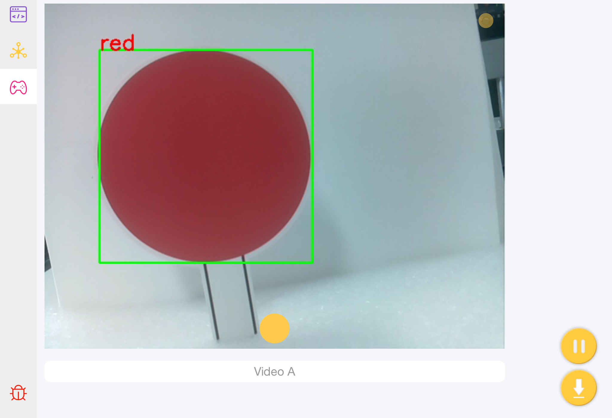
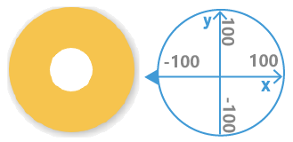
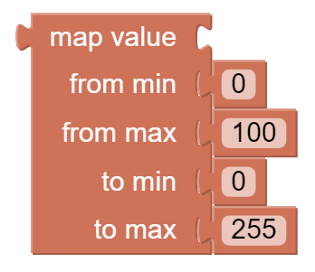
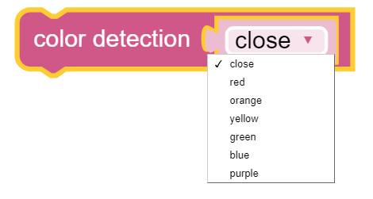
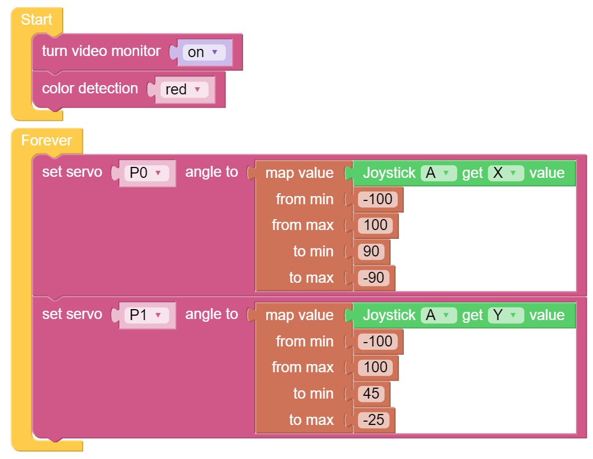

Color Detection - Ezblock
=========================

Let us learn the color detection of Pan-Tilt HAT. Let's adjust the direction of the camera with the joystick and check the color detection results displayed on the camera monitor.

**TIPS**

Drag the joystick to the center area. When using it, drag the white point in it to generate coordinates (-100~100).

This block reads the Joystick value in the Bluetooth control page. You can click the drop-down menu to switch to the Y-axis reading.

This block is used to drive the servo arm to rotate in a certain direction.

The map block can remap a number from one range to another. If a number is 50，it is at 50% position of the range of 0~100; then if we map it to the range 0~255 via the map block, the number will be 127.5.

You can use this block to choose the detected color. Only one color can be detected for each detection.

**EXAMPLE**

