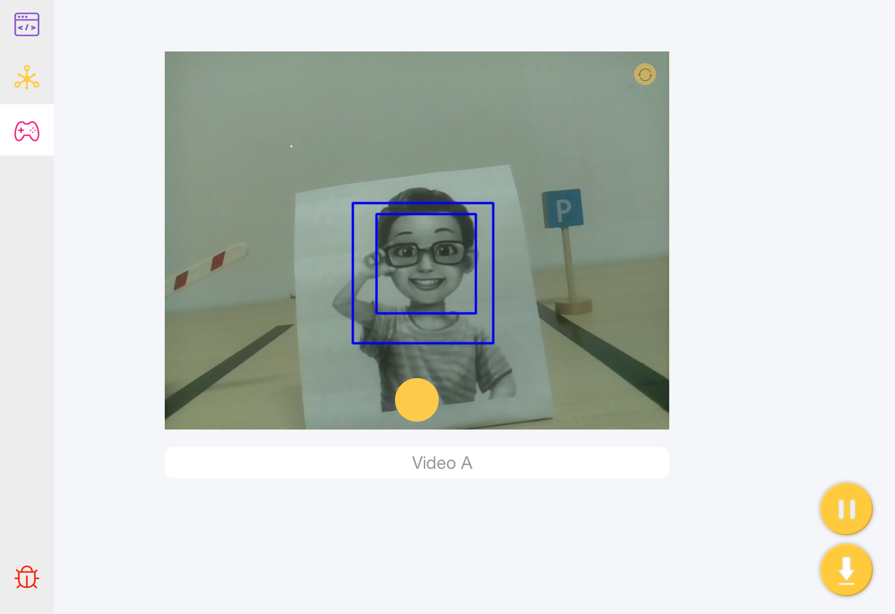

Face Detection - Ezblock
========================

Next, it's time to go in to learn about the face detection of Pan-Tilt HAT. The Pan-Tilt HAT can print the number of the detected faces on the debug monitor.

**TIPS**

A print block can be used to print data or text on the debug monitor.

The data printed by the Print block will appear in the Debug Monitor on the left. In other pages, you can also click on the Debug Monitor in the upper right corner.

You may want to use text block to print the combination of texts and data at once.

You need to turn on face detection.

You can read the results of face detection through this block, modify the drop-down menu options, and choose to read the coordinates, size or number of the results of face detection.

**EXAMPLE**

