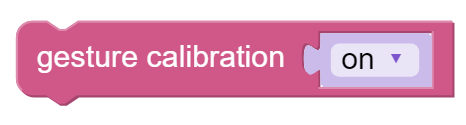

Gesture Calibration - Ezblock
=============================

Gesture detection is easily influenced by environmental factors, so we need first to calibrate gestures then enable gesture detection.

**TIPS**

Here we drag a Switch from the Bluetooth control page. After that a Remote category will appear.

This blocks read the switch state in the Bluetooth control page.

To achieve conditional judgment of “if” type, you need to use an if do block.

Calibrate your gesture by using this block. In the drop-down menu, choose on, the calibration will be on; otherwise, the calibration will be off.

**EXAMPLE**

After the code is uploaded, let the switch "ON" , there will appear a white square in the center of camera monitor. Put out your hand and place the palm in the square. Let it "OFF" when you finish the calibration.

.. note:: When the gesture is being calibrated, the camera should avoid being directly radiated by light. After calibration is complete, you need to press the reset key on the Pan-Tilt HAT to take effect.