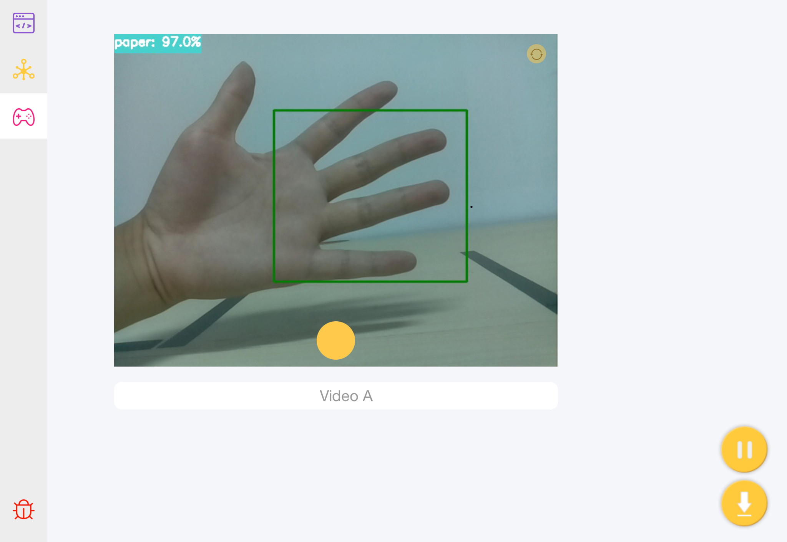
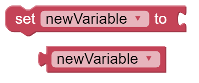
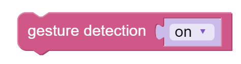
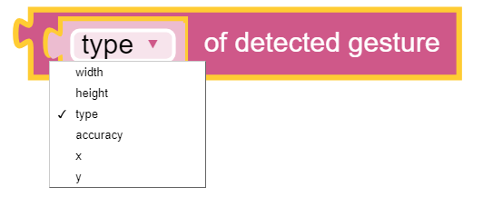
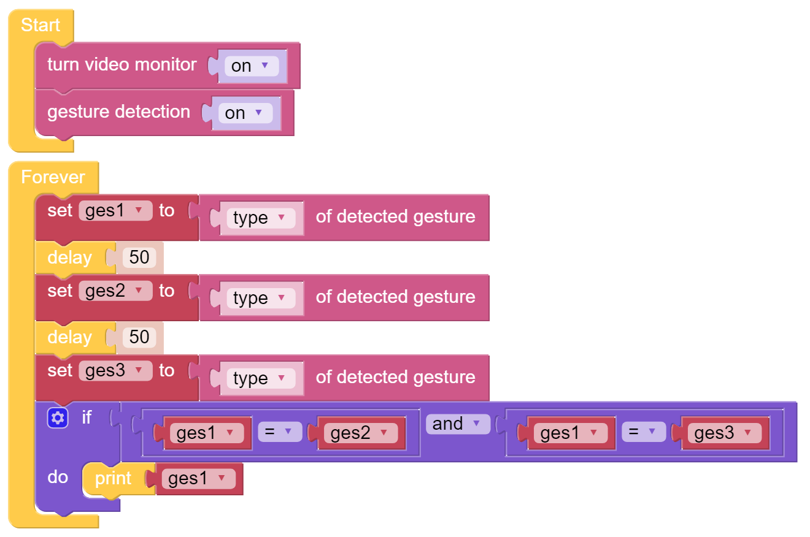

Gesture Detection - Ezblock
===========================

Completed the gesture calibration, we can start using Pan-Tilt HAT to detect our gestures. Now, what can be detected by our Pan-Tilt HAT includes rock, scissor, paper.

**TIPS**

You may want to simplify your program with Variable. For example, when you need to use the values of the type of gesture repeatedly, just assign them to variables for repeated use instead of reading repeatedly.

Click the Create variable button on the Variables category to create a new variable.

This block is used to do conditional judgement. Judging conditions can be "=", ">", "<", "≥", "≤", "≠".

This block is used to do "logical judgment" and judging conditions can be "and", "or" etc.

You need to turn on gesture detection.

You can read the results of the detected gesture through this block. In the drop-down menu, choose to read the coordinates, size, type or accuracy of the detected gesture.

**EXAMPLE**

