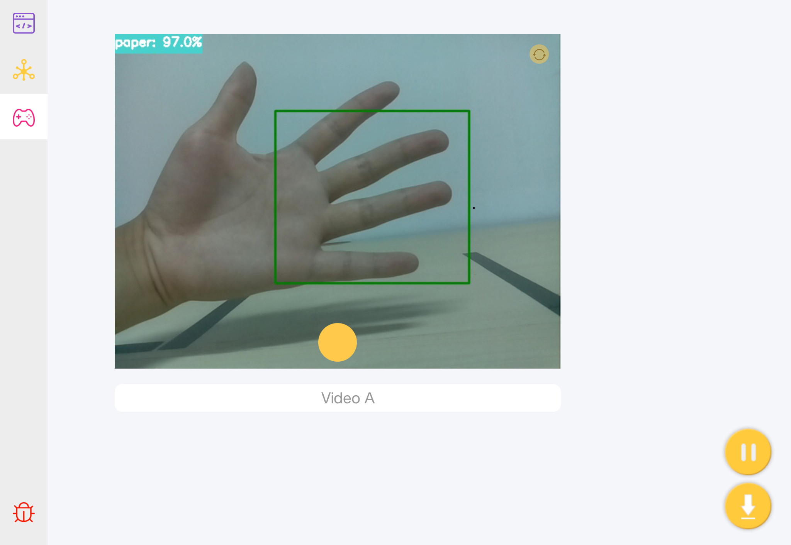
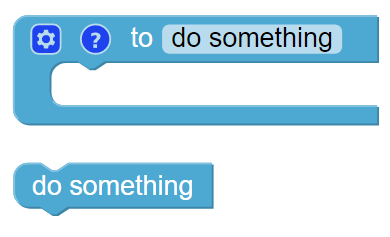
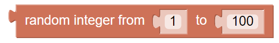
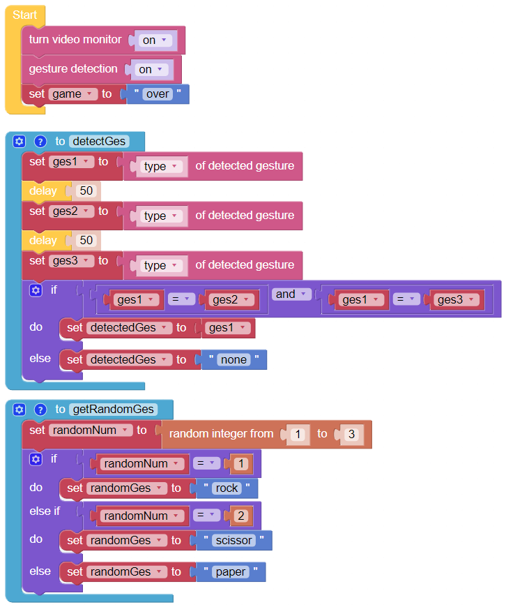
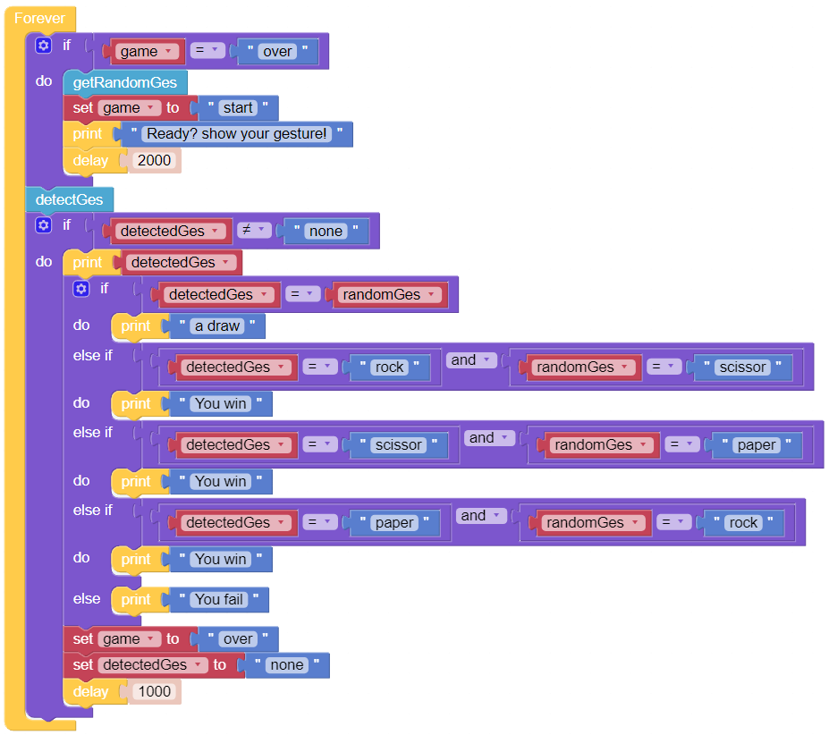

Play Rock-paper-scissor
========================

Let's play Rock-Paper-Scissor with Pan-Tilt HAT. Pan-Tilt HAT can judge who is the winner according to your gestures and print the result. 

**TIPS**

You may want to simplify the program with Functions, especially when you perform the same operation multiple times. Putting these operations into a newly declared function can greatly facilitate your use.

This block produces a random integer in a certain range and you can modify the upper and lower limits.

**EXAMPLE**

