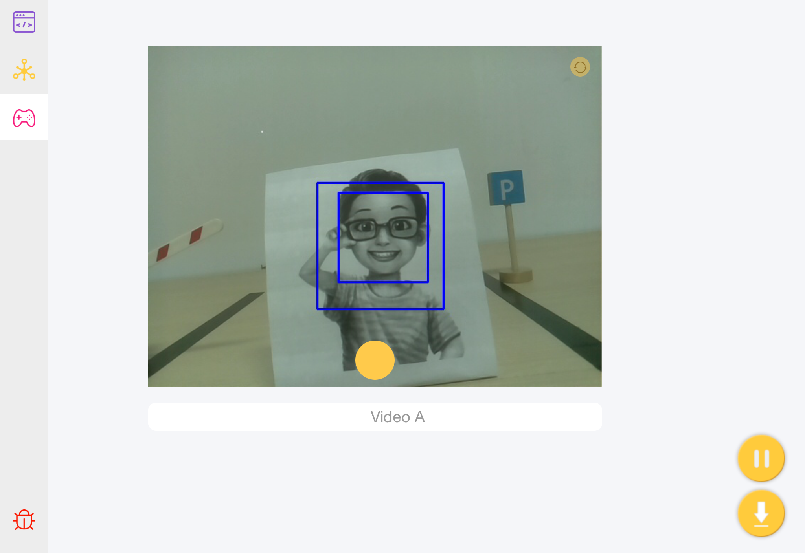
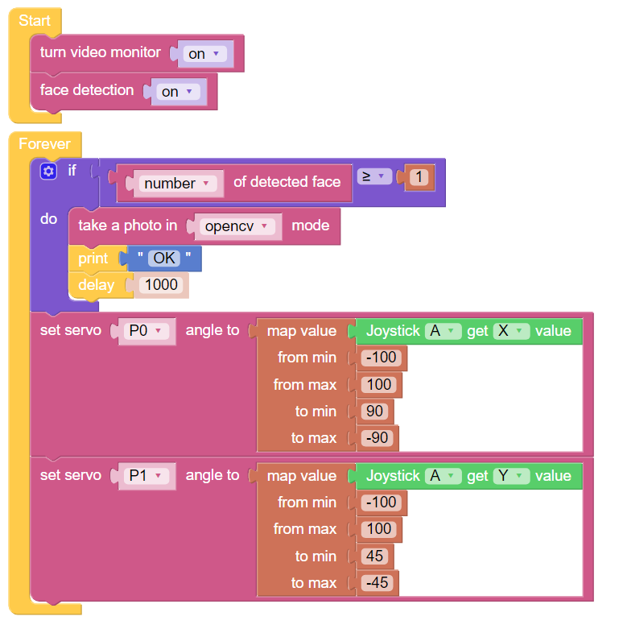

Say Cheese
==========

Let’s try to implement a simple project with Pan-Tilt HAT: remotely control Pan-Tilt HAT’s movement. When Pan-Tilt HAT sees people, it will take a photo then print “OK”.

**EXAMPLE**

