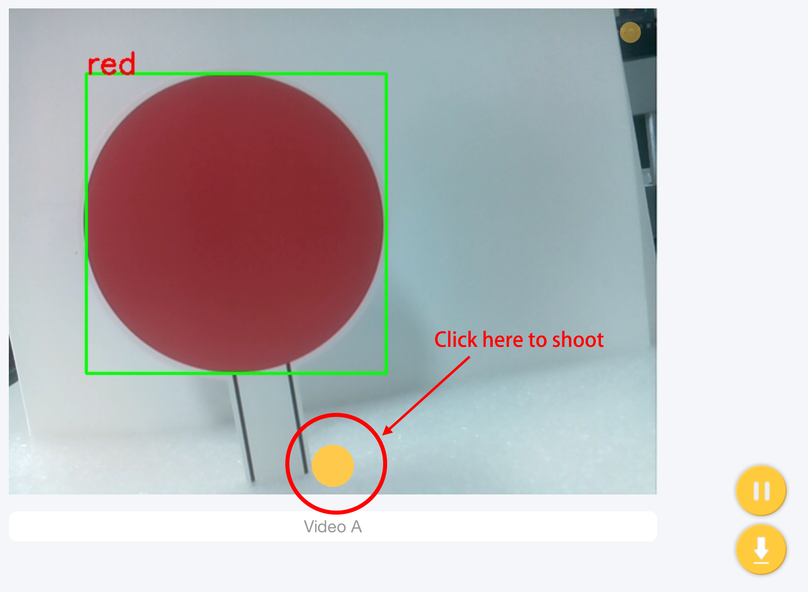
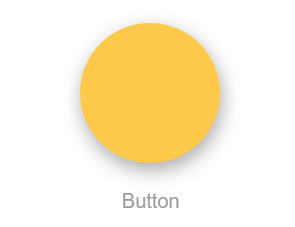
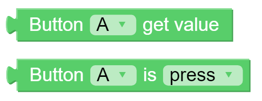
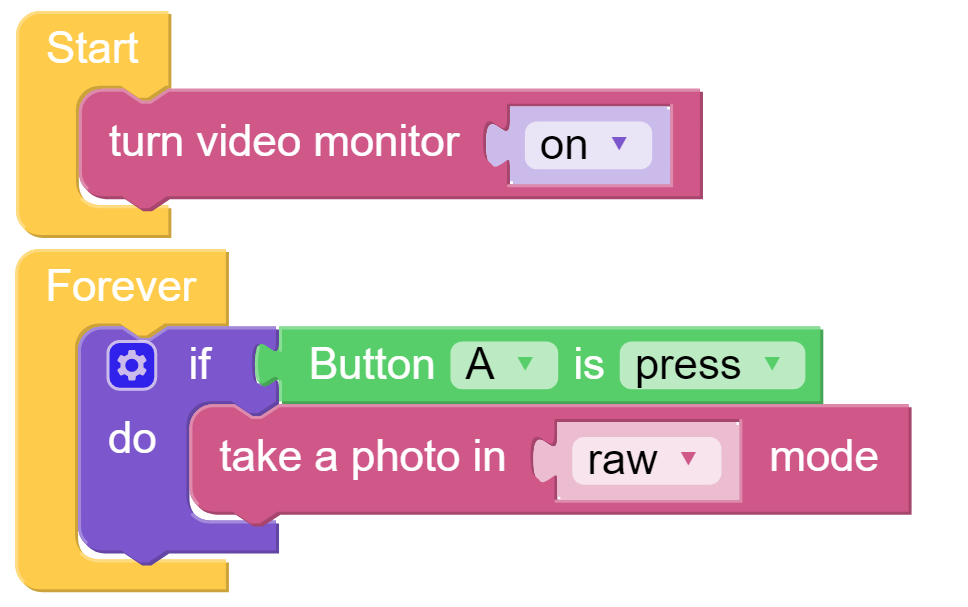

Take Photo - Ezblock
====================

Pan-Tilt HAT can take a photo. We use button to simulate a shutter, and once you press it, you can get a photo. This method will store the photos in the Raspberry Pi. In some projects that use algorithms to process images, this feature will be useful.

If you need to store the photos directly on the tablet (or computer), please click the dot on the Video widget.

**TIPS**

Drag a Button to the central area. 

Judge if the button is pressed.

Use this block to take a photo. In the drop-down menu, choose raw or opencv.

.. note:: Before you choose opencv, enable at least one kind of detection (color/face/gesture/traffic sign detection). During your shooting, the information of detected objects appears with a frame; for example, if the color detection (red) is enabled, on the photo, the red area will be marked with a frame and the information "red" will be indicated.

**EXAMPLE**

