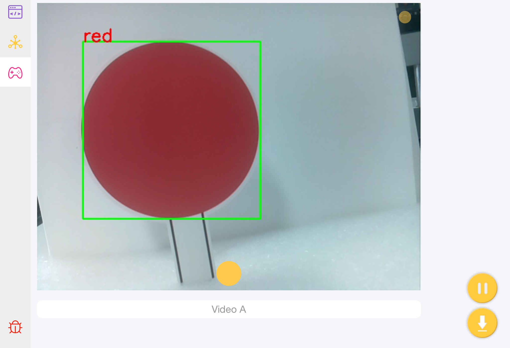
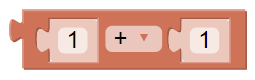
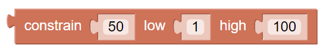
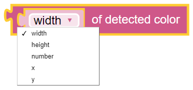
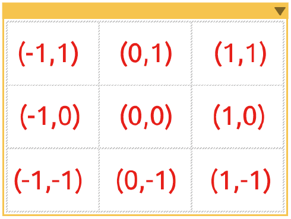
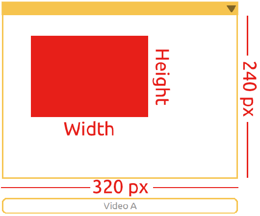
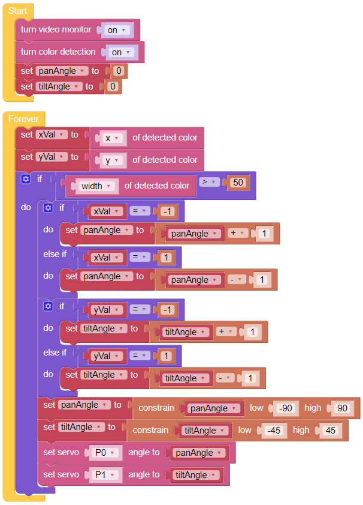

Color Tracking
==============

Prepare a small red ball and place it directly in front of the camera of Pan-Tilt HAT. The camera can consistently track the ball. This project may be little harder than the previous projects.

**TIPS**

Mathematical operation block can perform "+ , - , x , ÷".

This block is often used together with variables to limit their ranges.

You can get the information of detected color through this block. Modify the drop-down menu options, and choose to read the coordinates, size or number.

The “object detection” can output the detected coordinate value (x, y) based on the center point of the graphic. The screen is divided into a 3x3 grid, as shown on the left.

The “object detection” can detect the size (Width & Height) of the graphic. 

.. note::In the above two usages, if multiple targets are identified, the largest target will be the sole result.

**EXAMPLE**

