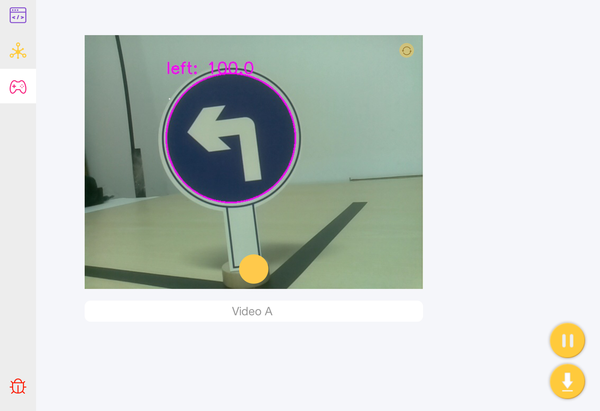
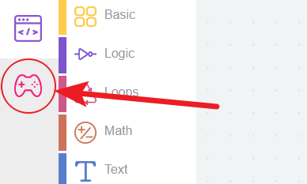

Traffic Sign Detection - Ezblock
================================

Firstly, we learn how to use Pan-Tilt HAT to detect traffic signs. During this operation, we can master how to enable and use RPi camera. 

**TIPS**

Click the this icon to enter the Bluetooth control page to enable the camera monitor.

Here we drag a Video from the page, and it will generate a monitor.

You need to open the image in Video by turning video monitor to on. Turning it to off will close the image (but not object detection).

Turn on traffic sign detection.

**EXAMPLE**

.. image::img/sp211111_151112.png