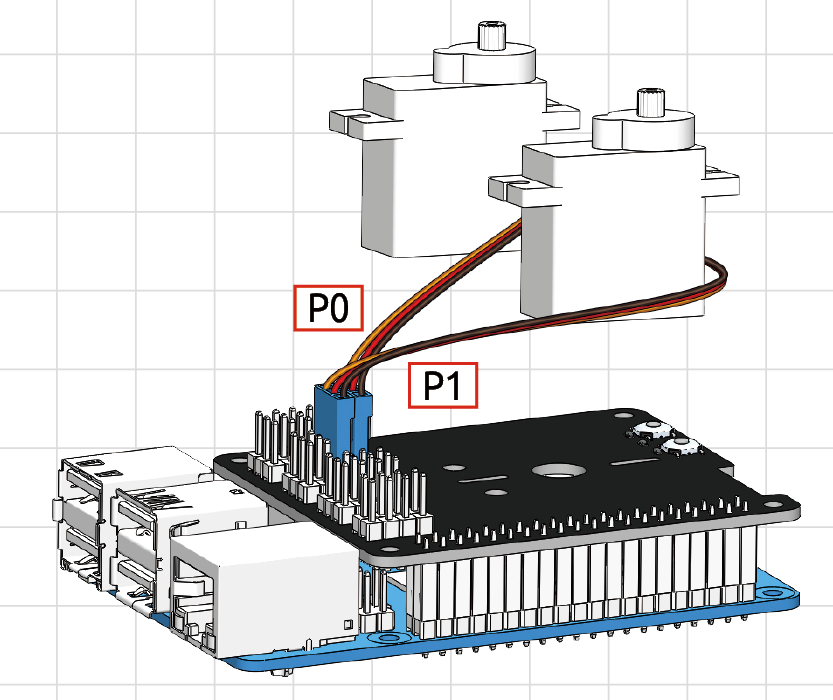
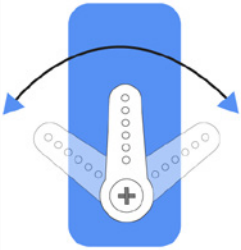

Quick Guide on Ezblock
===========================

There are 2 parts here:

* :ref:`Before Programming With Ezblock` will guide you to download Ezblock Studio to play with Pan-tilt HAT.
* :ref:`Before Assembling Pan-tilt HAT` allows you to keep all the servos at 0 degrees to complete a proper and safe assembly (otherwise you will probably damage the servos).

Before Programming With Ezblock
-------------------------------------

First download Ezblock Studio. 

For a detailed installation tutorial, please refer to: `Install Ezblock Studio <https://docs.sunfounder.com/projects/ezblock3/en/latest/quick_user_guide_for_ezblock3.html#install-ezblock-studio>`_.

.. note::

    After you connect the Pan-tilt HAT, there will be a calibration step. This is because of possible deviations in the installation process or limitations of the servos themselves, making some servo angles slightly tilted, so you can calibrate them in this step.
    
    But if you think the assembly is perfect and no calibration is needed, you can also skip this step.

Before Assembling Pan-tilt HAT
--------------------------------

Before assembling the Pan-tilt HAT, follow the instructions on how to install the Ezblock OS on an Micro SD card here: `Download and Install Ezblock OS <https://docs.sunfounder.com/projects/ezblock3/en/latest/quick_user_guide_for_ezblock3.html#download-and-install-ezblock-os>`_.

Temporarily combine the HAT and Raspberry Pi. Run "Color Detection" Example (This example will put the servo at the zero position).

Insert the servo cable into the P0 & P1 port. Now the servo arm should return to the 0° position. 

To make sure the servo has been correctly set to 0°, first gently insert a rocker arm in the servo shaft, then slightly rotate the rocker arm to a different angle.

