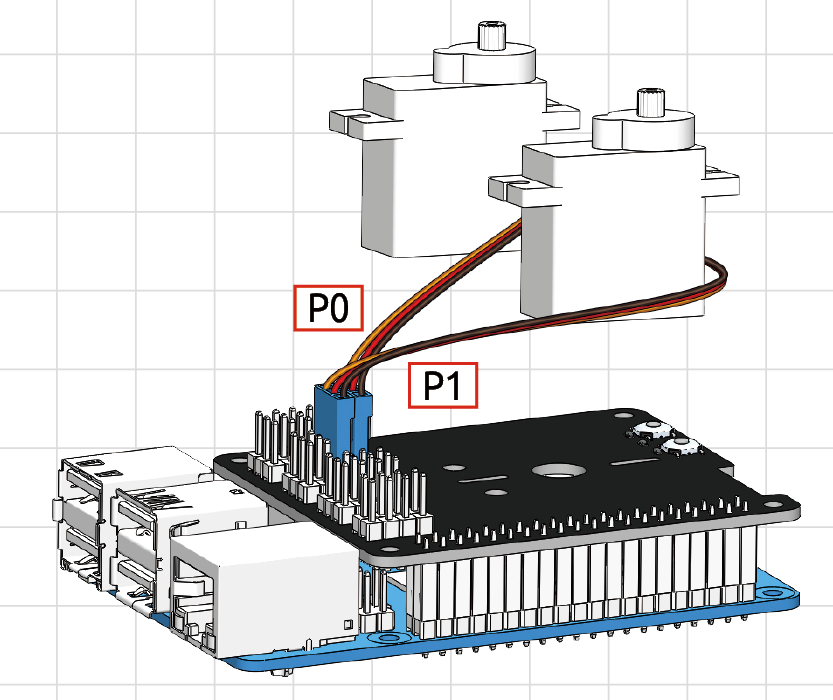

Download and Run the Code
============================

Download the Code Install Libraries
--------------------------------------
We can download the files by using ``git clone`` in the command line.

.. raw:: html

    <run></run>

.. code-block::

    cd /home/pi/
    git clone https://github.com/sunfounder/pan-tilt-hat.git
    cd pan-tilt-hat
    sudo python3 install.py

.. note::
    Running ``install.py`` will download some necessary components. You may fail to download due to network problems. You may need to download again at this time.

Run ``servo_zeroing.py``
--------------------------

.. Before you run any code, enable your Raspberry Pi's I2C port, see: :ref:`I2C configuration`.

Run the ``servo_zeroing.py`` in the ``examples/`` folder.

.. raw:: html

    <run></run>

.. code-block::

    cd /home/pi/pan-tilt-hat/examples
    sudo python3 servo_zeroing.py

To make sure you can see that the servo has been set to 0°, you can insert a rocker arm in the servo shaft first and then turn the servo to another angle.

.. image:: img/servo_arm.png
    :align: center

Now follow the diagram below and insert the servo to the 12/13 position.

Now if the servo arm shifts and stops at a specific position, the function will take effect. If it is not, please check the insertion direction of the servo cable and re-run the code.