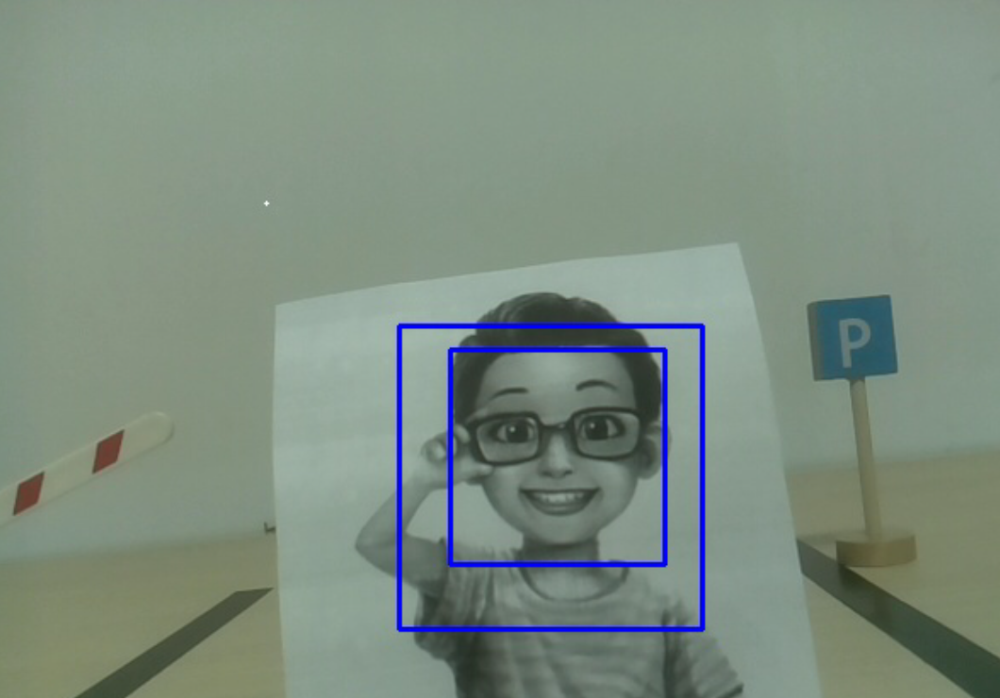

Face Detection
=======================

Face detection is the first step in building a face recognition system.
It will uniformly calibrate the face according to the key points in the face (such as the position of the eyes, the position of the nose, the position of the mouth, the contour points of the face, etc.) and mark the area containing the face.
This technology is widely used in security and other scenarios.

**Run the Code**

.. raw:: html

    <run></run>

.. code-block::

    cd /home/pi/pan-tilt-hat/examples
    sudo python3 face_detection.py

**View the Image**

After the code runs, the terminal will display the following prompt:

.. code-block::

    No desktop !
    * Serving Flask app "vilib.vilib" (lazy loading)
    * Environment: production
    WARNING: Do not use the development server in a production environment.
    Use a production WSGI server instead.
    * Debug mode: off
    * Running on http://0.0.0.0:9000/ (Press CTRL+C to quit)

Then you can enter ``http://<your IP>:9000/mjpg`` in the browser to view the video screen. such as:  ``https://192.168.18.113:9000/mjpg``

.. image:: image/display.png

**Code** 

.. code-block:: python

    from vilib import Vilib
    from time import sleep

    def object_show():
        print("Number: ",Vilib.detect_obj_parameter['human_n'])
        human_coodinate = (Vilib.detect_obj_parameter['human_x'],Vilib.detect_obj_parameter['human_y'])
        human_size = (Vilib.detect_obj_parameter['human_w'],Vilib.detect_obj_parameter['human_h'])
        print("Coordinate:",human_coodinate,"Size",human_size)

    def main():
        Vilib.camera_start(vflip=True,hflip=True)
        Vilib.display(local=True,web=True)
        Vilib.human_detect_switch(True)  

        while True:
            object_show()
            sleep(0.2)
                

    if __name__ == "__main__":
        main()

**How it works?**

Functions related to human face detection:

* ``Vilib.human_detect_switch(True)`` : Switch ON/OFF face detection

The keys of the dictionary and their uses are shown in the following list:

* ``human_x``: the x value of the center coordinate of the detected human face, the range is 0~320
* ``human_y``: the y value of the center coordinate of the detected face, the range is 0~240
* ``human_w``: the width of the detected human face, the range is 0~320
* ``human_h``: the height of the detected face, the range is 0~240
* ``human_n``: the number of detected faces
