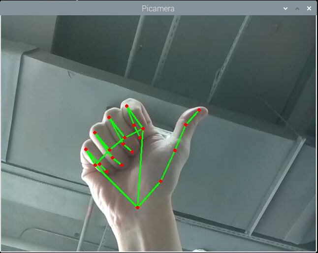
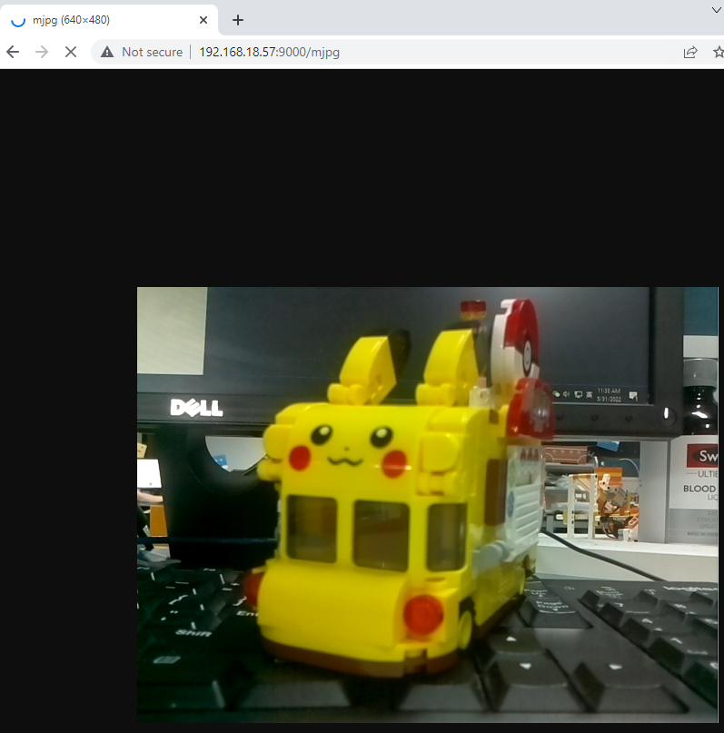

Hands Detection
==========================

Hand detection is a research hotspot in the field of human-computer interaction, allowing people to issue instructions to the computer without the mouse and keyboard. For example, use your fingers to command the robot, or play a guessing game with the robot, and so on.

In this project, you will see that the hand in front of the camera is recognized and the coordinates of the index finger will be printed.

**Run the Code**

.. raw:: html

    <run></run>

.. code-block::

    cd /home/pi/pan-tilt-hat/examples
    sudo python3 hands_detection.py

**View the Image**

After the code runs, the terminal will display the following prompt:

.. code-block::

    No desktop !
    * Serving Flask app "vilib.vilib" (lazy loading)
    * Environment: production
    WARNING: Do not use the development server in a production environment.
    Use a production WSGI server instead.
    * Debug mode: off
    * Running on http://0.0.0.0:9000/ (Press CTRL+C to quit)

Then you can enter ``http://<your IP>:9000/mjpg`` in the browser to view the video screen. such as:  ``https://192.168.18.113:9000/mjpg``

**Code**

.. code-block:: python

    from vilib import Vilib
    from time import sleep

    def main():
        Vilib.camera_start(vflip=True,hflip=True)
        Vilib.display(local=True,web=True)
        Vilib.hands_detect_switch(True)
        joints = []
        while True:
            joints = Vilib.detect_obj_parameter['hands_joints']
        
            if isinstance(joints,list) and len(joints) == 21:
                print(joints[8])

            sleep(1)

    if __name__ == "__main__":
        main()

**How it works?** 

This function has been encapsulated in the ``vilib`` library, execute ``Vilib.hands_detect_switch(True)`` to start hand detection.

The information detected by the target will be stored in the ``Vilib.detect_obj_parameter['hands_joints']`` .

The three-dimensional coordinates of the 21 joints of the hand are stored here, such as the ``joints[8]`` printed in this article, that is, the coordinates of the index finger. The serial numbers of all joints are shown in the figure below.

.. image:: image/hand_landmarks.png

The coordinates of these joints are composed of [x,y,z]. x and y are normalized to 0.0 ~ 1.0 by the width and height of the image (rather than the specific pixel position), the upper left corner of the screen is [0.0, 0.0], and the lower right corner is [1.0, 1.0]. The z coordinate represents the depth, and the wrist depth is the origin. The smaller the value, the closer the landmark is to the camera. The size of z uses roughly the same ratio as x.

This feature is based on `MediaPipe Google <https://mediapipe.dev/>`_, please see more knowledge in `Hands - MediaPipe <https://google.github.io/mediapipe/solutions/hands.html>`_ .