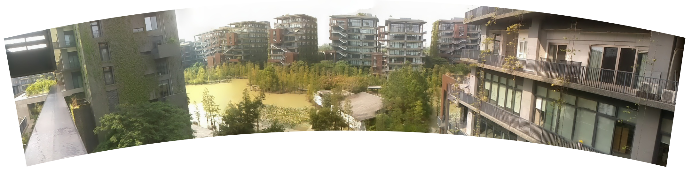

Panorama
====================

A panorama is a wide-angle view or representation of the physical space, which is composed of multiple standard photos stitched together to bring a visual wonder with a field of view far beyond the human eye.

In this article, you will use the slow rotation of the pan-tilt to obtain multiple photos to combine a long panorama picture.

**Run the Code**

.. raw:: html

    <run></run>

.. code-block::

    cd /home/pi/pan-tilt-hat/examples
    sudo python3 panorama.py

**View the Image**

After the code runs, the terminal will display the following prompt:

.. code-block::

    No desktop !
    * Serving Flask app "vilib.vilib" (lazy loading)
    * Environment: production
    WARNING: Do not use the development server in a production environment.
    Use a production WSGI server instead.
    * Debug mode: off
    * Running on http://0.0.0.0:9000/ (Press CTRL+C to quit)

Then you can enter ``http://<your IP>:9000/mjpg`` in the browser to view the video screen. such as:  ``http://192.168.18.113:9000/mjpg``

.. image:: img/display.png

**Code**

.. code-block:: python

    #!/usr/bin/env python3
    from time import sleep,strftime,localtime
    from vilib import Vilib
    import sys
    sys.path.append('./')
    from servo import Servo
    import cv2
    import os

    import tty
    import termios

    # region  read keyboard 
    def readchar():
        fd = sys.stdin.fileno()
        old_settings = termios.tcgetattr(fd)
        try:
            tty.setraw(sys.stdin.fileno())
            ch = sys.stdin.read(1)
        finally:
            termios.tcsetattr(fd, termios.TCSADRAIN, old_settings)
        return ch

    manual = '''
    Press keys on keyboard to record value!
        Q: take panoramic photo
        G: Quit
    '''
    # endregion

    # # check dir 
    def check_dir(dir):
        if not os.path.exists(dir):
            try:
                os.makedirs(dir)
            except Exception as e:
                print(e)

    # region init
    pan = Servo(pin=13, min_angle=-90, max_angle=90) # pan_servo_pin (BCM)
    tilt = Servo(pin=12, min_angle=-90, max_angle=30) # be careful to limit the angle of the steering gear
    panAngle = 0
    tiltAngle = 0
    pan.set_angle(panAngle)
    tilt.set_angle(tiltAngle)
    # endregion

    Status_info = {
        0: 'OK',
        1: 'ERR_NEED_MORE_IMGS',
        2: 'ERR_HOMOGRAPHY_EST_FAIL',
        3: 'ERR_CAMERA_PARAMS_ADJUST_FAIL',
    }

    def panorama_shooting(path):
        global panAngle,tiltAngle

        temp_path = "/home/pi/Pictures/vilib/panorama/.temp/"
        imgs =[]

        # check path
        check_dir(path)
        check_dir(temp_path)

        # take photo    
        for a in range(panAngle,-81,-5):
            panAngle = a
            pan.set_angle(panAngle)
            sleep(0.1)

        num = 0
        for angle in range(-80,81,20):
            for a in range(panAngle,angle,1):
                panAngle = a
                pan.set_angle(a)
                sleep(0.1)
            sleep(0.5)
            # sleep(0.5)
            print(num,angle)
            Vilib.take_photo(photo_name='%s'%num,path=temp_path)
            sleep(0.2)
            num += 1

        # stitch image 
        stitcher = cv2.Stitcher_create(cv2.Stitcher_SCANS)

        for index in range(num):
            imgs.append(cv2.imread('%s/%s.jpg'%(temp_path,index)))
        print('imgs num: %s, '%len(imgs))

        status,pano = stitcher.stitch(imgs)

        # imwrite and imshow
        print('status: %s , %s'%(status,Status_info[status]))
        if status == 0:
            cv2.imwrite('%s/%s.jpg'%(path,strftime("%Y-%m-%d-%H.%M.%S", localtime())),pano)
            cv2.imshow('panorama',pano)

        # remove cache
        os.system('sudo rm -r %s'%temp_path)

    # main

    def main():
        path = "/home/pi/Pictures/vilib/panorama"
        Vilib.camera_start(vflip=True,hflip=True)
        Vilib.display(local=True,web=True)
        sleep(2)

        print(manual)
        while True:
            key = readchar()
            # take photo
            if key == 'q': 
                print("panorama shooting ...")
                panorama_shooting(path)
            # esc
            if key == 'g':
                print('Quit')
                Vilib.camera_close()
                break 
        
            sleep(0.01)   

    if __name__ == "__main__":
        main()

**How it works?**

The core functions of this example are placed in the ``panorama_shooting(path)`` function. This function includes the following parts:

1. Path management: that is, ``checkdir()``.

2. Photograph:

    .. code-block:: python

        # take photo    
        for a in range(panAngle,-81,-5):
            panAngle = a
            pan.set_angle(panAngle)
            sleep(0.1)

        num = 0
        for angle in range(-80,81,20):
            for a in range(panAngle,angle,1):
                panAngle = a
                pan.set_angle(a)
                sleep(0.1)
            sleep(0.5)
            # sleep(0.5)
            print(num,angle)
            Vilib.take_photo(photo_name='%s'%num,path=temp_path)
            sleep(0.2)
            num += 1

    Here, the two functions of taking pictures and steering gear control are put together. The pan servo starts to deflection slowly counterclockwise from the -80° position, and takes a picture every 20° deflection, until the 80° position ends. After execution, you will get 9 temporary photos, which are stored in the path ``temp_path``.

3. Stitching photos:

    .. code-block:: python

        # stitch image 
        stitcher = cv2.Stitcher_create(cv2.Stitcher_SCANS)

        for index in range(num):
            imgs.append(cv2.imread('%s/%s.jpg'%(temp_path,index)))
        print('imgs num: %s'%len(imgs))

        status,pano = stitcher.stitch(imgs)

        # imwrite and imshow
        print('status: %s , %s'%(status,Status_info[status]))
        if status == 0:
            cv2.imwrite('%s/%s.jpg'%(path,strftime("%Y-%m-%d-%H.%M.%S", localtime())),pano)
            cv2.imshow('panorama',pano)

        os.system('sudo rm -r %s'%temp_path)

    These photos are added to an array ``imgs``, and then call OpenCV's Stitcher module (ie ``status,pano = stitcher.stitch(imgs)``) to merge them into a panorama ``pano``. Finally, use ``cv2.imwrite()`` to write ``pano`` into the storage space, and delete the temporary photos and their paths.

    For more details, please see `Stitcher-Docs <https://docs.opencv.org/3.4.15/d2/d8d/classcv_1_1Stitcher.html#a34152e67e9b04306236b6d570e9adf30>`_ and `Image file reading and writing-OpenCV <https:/ /docs.opencv.org/3.4.15/d4/da8/group__imgcodecs.html#gabbc7ef1aa2edfaa87772f1202d67e0ce>`_.
