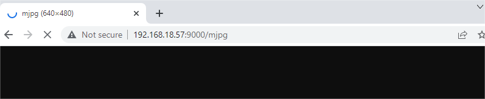

Take Photo
=======================

This is the first python example of Pan-tilt HAT. Here you can use Pan-tilt HAT to take a photo and store it in ``/home/pi/Pictures/vilib/``.

**Run the Code**

.. raw:: html

    <run></run>

.. code-block::

    cd /home/pi/pan-tilt-hat/examples
    sudo python3 take_photo.py

After the program runs:
1. You can enter ``http://<Your Raspberry Pi IP>:9000/mjpg`` in the browser (such as chrome) to view the viewfinder screen.
2. Type ``q`` in Terminal and press Enter to take a photo.

**View the Image**

After the code runs, the terminal will display the following prompt:

.. code-block::

    No desktop !
    * Serving Flask app "vilib.vilib" (lazy loading)
    * Environment: production
    WARNING: Do not use the development server in a production environment.
    Use a production WSGI server instead.
    * Debug mode: off
    * Running on http://0.0.0.0:9000/ (Press CTRL+C to quit)

Then you can enter ``http://<your IP>:9000/mjpg`` in the browser to view the video screen. such as:  ``http://192.168.18.113:9000/mjpg``

**Code**

.. code-block:: python

    #!/usr/bin/env python3
    from vilib import Vilib
    import time

    manual = '''
    Press keys on keyboard to record value!
        Q: photo shoot
        G: Quit
    '''

    def main():
        path = "/home/pi/Pictures/vilib/"

        Vilib.camera_start(vflip=True,hflip=True) 
        Vilib.display(local=True,web=True)
        time.sleep(2)

        print(manual)
        while True:
            try:
                key = input().lower()
                if key == "q":
                    _time = time.strftime("%y-%m-%d_%H-%M-%S", time.localtime())
                    Vilib.take_photo(photo_name=str(_time),path=path)
                    print("The photo save as %s%s.jpg"%(path,_time))
                elif key == "g" :
                    Vilib.camera_close()
                    break 
            except KeyboardInterrupt:
                Vilib.camera_close()
                break
                

    if __name__ == "__main__":
        main()

**How it works?**

The content involved in this article is exactly the basic function of the ``vilib`` library. We have already installed this library in :ref:`Download and Run the Code`.

What you need to focus on is the following:

.. code-block:: python

    from vilib import Vilib

All functions related to computer vision are encapsulated in this library.

.. code-block:: python

    Vilib.camera_start(vflip=True,hflip=True) 

Let the camera module enter the working state. If you modify the two parameters of this function to ``False``, the screen will be flipped horizontally/vertically.

.. code-block:: python

    Vilib.camera_close()

Stop the camera module.

.. code-block:: python

    Vilib.display(local=True,web=True)

Allows you to see the picture taken by the camera module.
* Its parameter ``local=True`` is used to open the viewfinder in the Raspberry Pi desktop, which is suitable for :ref:`Remote Desktop` or the situation where a screen is provided for the Raspberry Pi.
* The parameter ``web=True`` allows you to view the image through the browser, which is the method suggested in this article. It is suitable for the situation where your PC and Raspberry Pi are connected to the same local area network.

.. code-block:: python

    Vilib.take_photo(photo_name=str(_time),path=path)

As the name suggests, this function takes pictures. The first parameter is the name of the generated image file, and the second parameter is the path where the file is located. They can all be customized.

Please see the next chapter for how to move and view the photos you have taken.