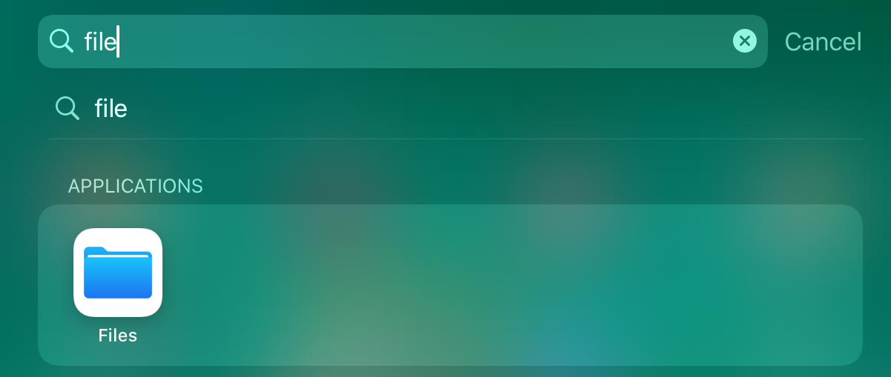

Check Photos
============

An easy way is to use :ref:`Filezilla Software` to drag and drop the photo files to the PC. However, its viewing experience is not very good.
We recommend that you use `Samba <https://www.samba.org/>`_ to turn the picture folder into an album that can be used in the local area network.

**Install Samba**

1. Run the command to set up Samba service.
  
.. raw:: html

    <run></run>

.. code-block::

    sudo apt-get update
    sudo apt-get install samba samba-common-bin

2. Configure Samba typing.
  
.. raw:: html

    <run></run>

.. code-block::

    sudo nano /etc/samba/smb.conf

.. note::
    
    Press ``ctrl+o`` to save what you modify in nano editor, ``ctrl+x`` to to exit.

Input the following content at the end of the file:

.. code-block::

    [share] 
    path = /home/pi/Pictures/ #This is your album path.
    valid users = pi 
    browseable = yes 
    public = yes 
    writable = yes 

3. Restart Samba service.
  
.. raw:: html

    <run></run>

.. code-block::

    sudo service smbd restart

4. Add sharing account.
  
.. raw:: html

    <run></run>

.. code-block::

    sudo smbpasswd -a pi

.. note::
    
    A sharing account \"pi\" is created and you need to set your passcode.

**Mount Photo Album to Windows**

Under This PC, click **Map network drive**.

.. image:: img/image10.jpg
    :align: center

Type ``\\hostname or IP address\the name of the shared files`` in the path bar. 

.. image:: img/image11.jpg
    :align: center

Type in the username and the password. Click OK button, 
and you can access the shared files.

The album will appear as a new volume under this PC.

**Mount Photo album to iOS**

The system newer than **iOS 13.0** can directly mount storage in Files. The older versions of iOS can use APPs like DS 
File.

1. Open **Files**.

2. Tap **Connect to Server** in **「Menu」**.

.. image:: img/15.png
    :align: center

3. Enter your Rascam IP address.

.. image:: img/16.png
    :align: center

4. Log in.

.. image:: img/17.png
    :align: center

5. Now, you can directly access the photo album in File.

.. image:: img/18.png
    :align: center